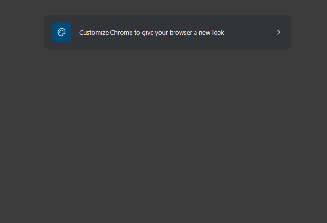

# WaterPleaseApp – Frontend

A React-based frontend for managing indoor plants, visualizing their placement on a grid map, and tracking watering schedules.

Backend repository: https://github.com/Anty-Anty/WaterPleaseApp-backend

## Live demo
https://waterpleaseapp.netlify.app

⚠️ Cold start notice
The backend is hosted on Render’s free tier.  
Initial load may take up to ~60 seconds due to server cold start

## Tech Stack
- React (Vite)
- CSS Modules / Custom CSS 
- Custom Hooks:
    -`useHttpClient`
    -`useForm`
- Drag & Drop (custom implementation)
- REST API integration

## Why I Built This

I built this app to practice full-stack React patterns, custom hooks,
state synchronization with a backend, and real-world UI edge cases
such as drag & drop and mobile date picker inconsistencies.

## Key Technical Decisions

### 1. Custom Hooks for Separation of Concerns
API communication and form state are handled through custom hooks (useHttpClient, useForm) to keep components focused on UI logic.
This improves readability, reusability, and makes side effects easier to reason about.

### 2. Grid-Based Map as Derived UI State
The map is rendered as a dynamic NxN grid based on backend configuration rather than a hardcoded layout.
Plant placement is derived from plant state (mapPosition) instead of duplicating data in the map, reducing the risk of desynchronization.

### 3. Optimistic UI Updates for Better UX
Create, update, delete, and drag-and-drop actions update local state immediately after successful API responses.
This keeps the interface responsive while still maintaining the backend as the source of truth.

### 4. Drag & Drop Without External Libraries
Drag-and-drop behavior was implemented manually instead of using a third-party library to:
- Reduce bundle size
- Keep full control over behavior
- Better understand native drag events and state synchronization

### 5. Mobile-Specific Date Picker Handling
iOS Safari has known issues with custom date inputs.
To ensure reliability across platforms, the app conditionally uses:
- Native <input type="date"> on iOS
- Custom date picker components on desktop browsers

### 6. Explicit Map Editing Workflow
Map edits are staged in temporary state before being persisted to the backend.
This allows users to:
- Preview changes
- Reset or cancel edits
- Avoid accidental destructive updates

### 7. Clear Frontend–Backend Contract
The frontend relies on consistent API responses and normalized identifiers, making it easy to:
- Sync plant data across views
- Update map positions independently
- Extend the app with new features (e.g. multiple maps or rooms)

## Features
### 🌱 Plant Management
- Create new plants with:
  - Name
  - Plant icon
  - Water level icon
  - Last watered date
  - Watering interval
- Edit existing plants
- Delete plants with confirmation modal

### 🗺 Interactive Map:
- Grid-based map layout (NxN)
- Select which squares are active
- Drag & drop plants onto the map
- Remove plants from map positions
- Visual indicators for:
    - Plant icon
    - Days until next watering
    - Overdue watering status

### 📅 Watering Logic:
- Automatically calculates days until next watering
- Highlights overdue plants
- iOS-friendly native date picker fallback
- Custom date picker for desktop browsers

### 🧠 State Management:
- Optimistic UI updates for CRUD actions
- Centralized API handling via useHttpClient
- Local UI state synced with backend

## Screenshots

